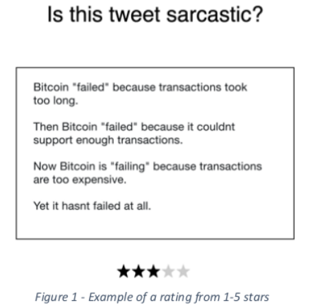

## AENIO

### An Expanding Network of Intelligent Oracles

#### Terms

*Oracle* - smart contracts can't retrieve API's or data themselves, so to have them update an
Oracle has to be used - this is typically done off-chain and via an external provider.

The main examples at the moment are;

- Oraclize - this is the only Oracle that is out of alpha/beta and in wide-spread use. 
  Typical use cases are; 
  - API to external services
  - integration with wolfram alpha
  - retrieving from IPFS (Interplanetary File System - a form of distributed file storage)
  - executing code stored on IPFS inside of a container.
- Augur and Gnosis are building decentralized prediction markets that they hope to turn into an Oracle-like service, with Gnosis recently adding a light description of how they will also use AI to their web page.

#### The Problem

This project aims to solve several issues that are currently impeding Enterprise-like use of
blockchains and smart contracts by the wider community.

1. The current Oracles that exist are very limited in the data they they product; and while they have the ability to connect to an external API, the API still has to be verified as trusted and the data needs to be what you want. 

   This lack of trust and reliability presents issues for companies/people wanting to build apps - as they need to be able to rely on the data they receive without having to constantly monitor it. 

   For many problems in the AI/ML space, this means companies would be forced to either build their own instance using existing ML libraries, or by customising some of the commoditised machine learning API's by Google/Microsoft/Amazon, etc. However, this is definitely not "plug and play" and still requires a significant amount of setup.

2. As current Oracles must be called by a smart contract, there is no decentralized way to trigger a smart contract based when a condition has been met (there are solutions like the Ethereum Alarm Clock, but this is not an ideal solution).

3. As all smart contracts need to be called by a transaction, all smart contracts are required to exist on-chain, as they need to be executed as the transaction is processed. 

#### Proposed Solution

I propose a blockchain that would have a network of Oracles integrated within it;, and
instead of focusing on API calls, would connect to cryptographically verified Nodes that pre-
process information (using current techniques in ML like sentiment analysis, etc) and are
able to trigger contracts in addition to being called by contracts.

This would enable us to move smart-contracts to a more platform like language, and allow
greater business usage and integration.

The Nodes in the network are not currently feasible to be smart contracts themselves for several reasons;

- Currently, computation is very expensive inside smart contracts (at least on Ethereum - there are blockchains that are looking to solve that like Dfinity). As an example, I was able to find a Perceptron (an element of a Neural Network) that had been made in solidity and while experimenting with it was awesome, the Gas costs make it unfeasible to actual use
- By performing analysis on the blockchain itself, we would lose access to all of the current tools for analysis such as Pandas, Tensorflow, etc. and be starting from scratch
- As the computation by current blockchain VM's only uses CPU/Storage resources, we would lose access to GPU processing which can be essential for timely, large-scale data analysis

#### High Level Details

##### The Validators

Validators in this blockchain perform a role that could be described as ‘Active Proof of Stake’.

Validators provide feedback on predictions or analysis components from the AI Nodes to ensure that they are accurate (the process is similar to manually validating the training of a dataset). I have included a few example images below.

The validator could be a dapp or a wallet like app.

The aggregate score would be the trust rating for that particular AI Node (detailed later), with a minimum number of ratings required to be used in the Processing Nodes (detailed later).

The validator Nodes are incentivised to act honestly as the rewards they receive are ‘locked-up’ for a period of time, and if their validations are consistently vastly different from the mode (in the case of Yes/No) or the average (in the case of 5 star ratings) their rewards are lost.

We could also require an initial lock-up of tokens – this would ensure the validator is involved with the network and create a cost for spam attacks against the validity of the network results.

##### AI Node

The AI Nodes are what gives the on-chain Oracle functionality; they process the data and return the results to the Processing Nodes.

To provide greater security the creation of an AI Node would require lockup of a number of tokens. 

These Nodes process a variety of AI/ML related tasks and receive micropayments for each transaction execution that uses their Node.

They would need to use a Node template to connect and/or meet the data requirements set out by the Processing Nodes/the network.

In the beginning, we could setup several base Nodes (Image Recog, Sentiment Analysis, etc) and allow users to create their own data pipeline which would allow a wide amount of data to be available for use by the blockchain.

##### Processing Node

In this network, the Processing Node fulfils the role of the miner (they would not be ‘mining’ in the Bitcoin sense however). They process transactions, execute smart contracts, and act as the intermediary between the validators and the AI nodes.

To provide greater security the creation of a Processing Node would require a lockup of a number of tokens.

##### Use Case

By adding on-chain Oracles and built in ML capabilities, we remove some of the roadblocks to mainstream/enterprise adoption of smart contracts and allow blockchain/smart contracts to truly be a platform for distributed applications.